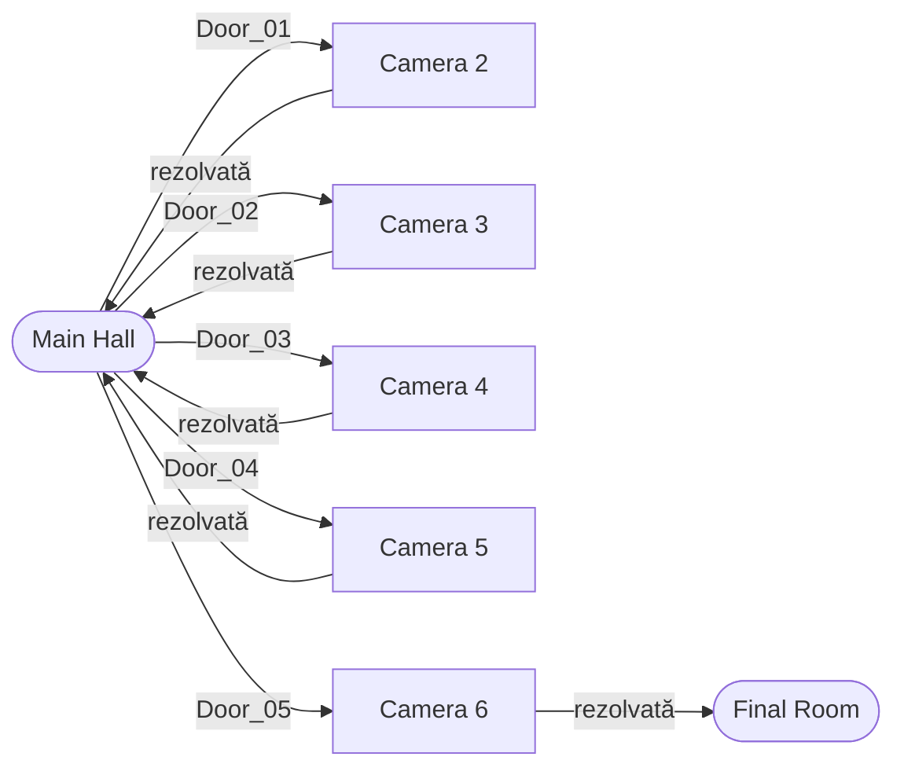

# Plan — legarea camerelor la Main Hall

**LUCID: Escape the Nightmare** · document de lucru pentru toată echipa

Cum ajungem de la camere separate, care nu se văd între ele, la un joc în care termini o cameră, te întorci în hol și se deschide următoarea.

> Actualizat după `git pull` la `da3b04f`. Prima versiune a acestui document a fost scrisă pe starea de la `1456c5b` și subestima serios cât e gata. Vezi punctul 2.

---

## 1. Unde suntem acum

Verificat direct în fișiere, după pull.

| Cameră | Scenă | Cine | Stare | Jucător |
|---|---|---|---|---|
| Main Hall | `Malvina_mainHall/MainHall.unity` | Malvina | **avansată** — vezi mai jos | da |
| Camera 2 | `Karina-camera2/findkey_room.unity` | Karina | decor: podea, tavan, o ușă | **nu** |
| Camera 3 | — | Rareș | folderul e gol | — |
| Camera 4 | `Ana-camera4/Camera_Ana.unity` | Ana | pat, uși, module | da, al ei |
| Camera 5 | `Sinzina-camera5/cam5TEST.unity` | Sînziana | keypad, lumini, ușă finală | da |
| Camera 6 | `Vlad-camera6/vld-room.unity` | Vlad | completă, cu mecanici | da |

---

## 2. Ce e deja construit în hol

Partea care schimbă tot planul. Malvina n-a făcut doar decor, a făcut aproape toată infrastructura de hub.

| Există deja | Unde |
|---|---|
| Dormitor de start + coridor + 5 uși | `MainHall.unity` |
| `Door_01` … `Door_05`, fiecare cu `DoorInteraction` și `doorNumber` completat | scena |
| `RoomAnchor_01` … `RoomAnchor_05` | scena |
| Vestibul în spatele fiecărei uși (podea, tavan, pereți, lampă) | `Door_0N_Transition_*` |
| Jucător first-person complet | `MainHall_Player` |
| Interacțiune pe rază, cu prompt `[E]` pe ecran | `PlayerInteraction` + `IInteractable` |
| Fade la negru, mesaj în mijloc, fade înapoi | `ScreenFadeController` |
| Iluminare cu lămpi reci și una slabă | grupul `Lighting` |

Adică **bucla de tranziție e deja scrisă**. Când apeși `E` pe o ușă, ecranul se stinge, apare textul *„You chose Door 01"*, apoi se aprinde la loc.

Singurul lucru care lipsește din tranziție: în loc de mesaj, să se încarce scena. Locul exact e `MainHallInteractionController.PlayDoorTransition()`.

### Ce lipsește

**Build Settings e tot gol.** `m_Scenes: []`. Niciun `LoadScene` nu funcționează până nu sunt adăugate scenele. Ăsta rămâne primul lucru de făcut și durează două minute.

**Nu există stare care să treacă între scene.** Nimeni nu ține minte ce cameră ai terminat.

**Camera 2 n-are jucător**, deci nu poate fi testată deloc în Play mode.

**Camera 5 are trei scene**: `cam5TEST.unity`, `NEIMPORTANTSinziana_camera5_test.unity` și `Echipa/camera5_sinziana_test.unity` (asta din urmă direct în `Echipa`, pe lângă foldere). Trebuie aleasă una singură ca fiind cea bună, restul șterse — altfel nu se știe ce se leagă.

---

## 3. Cum arată sistemul

Model hub-and-spoke. Holul e centrul, camerele sunt raze. Nu se trece niciodată direct dintr-o cameră în alta.



Bucla completă:

1. Jucătorul se trezește în dormitor și iese pe coridor. Ușa 1 e descuiată, restul sunt încuiate.
2. `[E]` pe `Door_01` → fade la negru → se încarcă scena camerei 2 → jucătorul apare la `intrare`.
3. Rezolvă camera. La ieșire trece printr-un trigger.
4. Triggerul spune `Progres.Termina("camera2")` și încarcă înapoi holul.
5. În hol apare **în fața ușii pe care a intrat**, la `RoomAnchor_01`, nu în dormitor.
6. Ușa 2 se descuie singură, fiindcă condiția ei e `camera2` terminată.
7. Se repetă. După camera 6 se deschide Final Room.

Ce se ține minte între scene: **camerele terminate** și **viețile rămase**. Atât. Inventarul se golește la intrarea în fiecare cameră — fiecare cameră e un puzzle închis, cu cheile ei.

---

## 4. Ce e de scris

Mult mai puțin decât părea. Patru fișiere noi mici, plus două modificări în ce există deja.

### Nou, în `Assets/Scripts`

| Fișier | Ce face |
|---|---|
| `Progres.cs` | clasă **statică**: ce camere sunt terminate, câte vieți au rămas |
| `Tranzitie.cs` | reține unde trebuie să apară jucătorul, apoi `SceneManager.LoadScene` |
| `PunctSpawn.cs` | marcaj cu `id`; la `Start` mută jucătorul aici dacă id-ul se potrivește |
| `IesireCamera.cs` | ieșirea din cameră: marchează terminat, încarcă holul. Două moduri — `LaTrecere` prin trigger, sau `LaDeschidere`, legat de un `SwingDoor`, pentru ieșiri prin care jucătorul nu poate trece fizic |

```csharp
public static class Progres
{
    public static bool ETerminata(string idCamera);
    public static void Termina(string idCamera);
    public static int  Vieti { get; }
    public static void PierdeOViata();
    public static void Reseteaza();
}
```

Static, fără `MonoBehaviour`, deci supraviețuiește automat schimbării de scenă. Sînziana folosește deja exact tiparul ăsta în `RoomState.cs`, deci nu e nimic nou pentru echipă.

`PunctSpawn` are un detaliu important: dacă nu vine nimeni de nicăieri — adică ai apăsat Play direct în scena aia — se folosește punctul cu id-ul `intrare`. Asta face ca **fiecare cameră să rămână jucabilă separat**, ceea ce e obligatoriu când lucrează cinci oameni în paralel.

### Modificat, în holul Malvinei

**`DoorInteraction.cs`** — două câmpuri în plus:

```csharp
[SerializeField] private string sceneName;      // "vld-room"
[SerializeField] private string cereTerminata;  // "camera5", gol = deschisă
```

**`MainHallInteractionController.PlayDoorTransition()`** — după fade, în loc să se oprească la mesaj, încarcă scena. Și înainte de fade, verifică `Progres.ETerminata(door.cereTerminata)`; dacă nu e, arată mesajul de ușă încuiată și nu mai pleacă nicăieri.

Astea sunt vreo 15 linii în total. Restul e deja scris.

---

## 5. Contractul dintre camere

Regulile pe care trebuie să le respecte **fiecare** cameră ca să se lege. Nimic altceva nu e impus — geometria, luminile, puzzle-ul, chiar și controllerul rămân ale fiecăruia.

| Ce | Cum se cheamă | Obligatoriu |
|---|---|---|
| Punct de intrare | `PunctSpawn` cu `id = "intrare"` | da |
| Ieșire | trigger cu `IesireCamera`, `spreScena = "MainHall"` | da |
| Id-ul camerei | `camera2` … `camera6` | da |
| Un jucător în scenă | oricare, dar unul singur | da |

Și în hol, câte un `PunctSpawn` pe fiecare `RoomAnchor_0N`, cu id-urile `dupa_camera2` … `dupa_camera6`.

**Numele de scene rămân cum sunt** — cu excepția camerei 5, unde trebuie ales care e cea bună. Redenumirea restului acum sparge munca tuturor și produce conflicte în git degeaba. Numele se pun o singură dată, într-un `NumeScene.cs` cu constante, și se redenumesc fișierele la final dacă mai vrea cineva.

---

## 6. Deciziile de luat

### Decizia 1 — controllerele de jucător: **nu blochează legarea**

Corectez ce scria în prima versiune a documentului. Sunt acum trei controllere first-person în proiect:

| | Vlad | Malvina | Ana |
|---|---|---|---|
| Input | System nou | System nou | **Input vechi** |
| Interacțiune | rază 3 m, prompt IMGUI | rază 3.2 m, prompt pe Canvas | distanță, fără prompt |
| Inventar / note | da | nu | nu |
| Fade / tranziții | nu | **da** | nu |

Jucătorul **nu** călătorește între scene — fiecare scenă își încarcă propriul jucător, iar între ele trece doar `Progres`, care e o clasă statică. Deci legarea camerelor funcționează chiar dacă fiecare cameră are alt controller. Nu e blocant.

Ce **este** o problemă reală: se simte ca alt joc de la o cameră la alta dacă viteza de mers și sensibilitatea mouse-ului diferă. Minimul necesar acum e să se pună **aceleași valori** în toate: viteză, sensibilitate, distanță de interacțiune, înălțime a camerei.

Unificarea pe un singur controller e o curățenie de făcut după ce merge legătura, nu înainte. Când se face, baza cea mai bună e cea a Malvinei — are Canvas, prompt și fade — plus inventarul și notele din `Assets/Scripts`.

### Decizia 2 — input: asta **chiar** e un risc

`activeInputHandler` e pe `2`, adică amândouă sistemele merg în paralel. Două controllere din trei sunt deja pe System-ul nou; doar al Anei e pe cel vechi. Dacă cineva pune valoarea pe `1`, camera 4 crapă la runtime.

Cel mai ieftin lucru: camera 4 se trece pe System nou (e un fișier de 61 de linii), apoi se pune `activeInputHandler: 1` și rămâne un singur sistem.

### Decizia 3 — ordinea camerelor

Ușile sunt numerotate `Door_01` … `Door_05`, camerele sunt 2…6. Planul presupune lanțul `2 → 3 → 4 → 5 → 6 → Final Room`. Dacă GDD-ul zice altfel, **nu se schimbă cod**: `sceneName` și `cereTerminata` se completează din Inspector pe fiecare ușă, deci ordinea se rearanjează în două minute.

### Decizia 4 — inventarul între camere

Propunerea: se golește la intrarea în fiecare cameră, fiindcă fiecare cameră e un puzzle închis. Dacă vreți obiecte care se cară dintr-o cameră în alta, inventarul se mută în `Progres` — se poate, dar complică, și puzzle-urile trebuie gândite altfel.

### Decizia 5 — camera 5, care scenă e cea bună

Trei scene, două cu `NEIMPORTANT` sau `test` în nume, una direct în `Echipa/`. Sînziana alege una, restul se șterg. Până atunci camera 5 nu se poate lega de nimic.

---

## 7. Etapele de lucru

### Etapa 0 — fundația · o oră · o singură persoană

- Toate scenele bune în **Build Settings**, cu `MainHall` prima.
- Se scriu `Progres.cs`, `Tranzitie.cs`, `PunctSpawn.cs`, `IesireCamera.cs`.

**Gata când:** poți apăsa Play în orice scenă din listă și jucătorul se mișcă.

### Etapa 1 — felia verticală · o zi

Se leagă **doar** Main Hall ↔ Camera 6, cap-coadă. O ușă, un drum dus-întors.

- `sceneName` și `cereTerminata` pe `Door_05`
- `LoadScene` în `PlayDoorTransition`, după fade
- `PunctSpawn` cu `id = "intrare"` în camera 6, peste `SPAWN_Player` care există deja
- `IesireCamera` pe trapa din camera 6
- `PunctSpawn` cu `id = "dupa_camera6"` pe `RoomAnchor_05`

**Gata când:** intri pe ușa 5, rezolvi camera 6, ieși pe trapă și apari în hol fix în fața ușii pe care ai intrat.

Etapa asta e cea mai importantă din tot documentul. Când merge un drum complet, restul e copy-paste. Până atunci, orice altceva e presupunere.

### Etapa 2 — restul ușilor · o zi

Celelalte patru uși primesc `sceneName` și `cereTerminata`. Camerele care încă nu există primesc scena goală și mesaj de ușă încuiată.

**Gata când:** o singură ușă e deschisă la început, restul dau mesaj la `[E]`, iar după fiecare cameră terminată se descuie următoarea.

### Etapa 3 — camerele se racordează una câte una · în paralel

Fiecare își face camera după contractul de la punctul 5. Nu depind unul de altul și nu depind de hol — se testează fiecare separat.

Camera 2 are nevoie întâi de un jucător. Camera 5 are nevoie întâi de decizia 5. Camerele 3 și 6 n-au datorii.

**Gata când:** poți parcurge toate camerele existente într-o sesiune, fără să oprești Play.

### Etapa 4 — ce cere GDD-ul și nu există nicăieri

Cele 3 vieți, save points, meniul de pauză, jumpscare-ul, inamicul, Final Room. Toate se sprijină pe `Progres`, deci abia acum se pot face corect.

Acum că TextMesh Pro e importat în proiect, interfața finală se poate face pe Canvas-ul Malvinei. HUD-ul meu din `GameHUD.cs` e IMGUI provizoriu și era scris așa tocmai fiindcă TMP lipsea — se rescrie doar acel fișier, restul sistemelor comunică prin evenimente și rămân neatinse.

---

## 8. Cine ce face

| Cine | Etapele 0–2 | Etapa 3 |
|---|---|---|
| **Malvina** | proprietar unic pe `MainHall.unity`; `PunctSpawn` pe cele 5 `RoomAnchor` | decorul și luminile holului |
| **Vlad** | `Progres`, `Tranzitie`, `PunctSpawn`, `IesireCamera`; felia verticală împreună cu Malvina | camera 6, deja gata |
| **Sînziana** | alege scena bună pentru camera 5 | intrare + ieșire în camera 5 |
| **Ana** | trece camera 4 pe Input System nou | intrare + ieșire în camera 4 |
| **Karina** | — | jucător, intrare și ieșire în camera 2 |
| **Rareș** | — | construiește camera 3 direct pe contract |

**O singură persoană umblă în `MainHall.unity` la un moment dat.** Scenele Unity se îmbină prost în git; două persoane care salvează holul în aceeași zi produc un conflict pe care nu-l rezolvă nimeni ușor.

Modificarea din `DoorInteraction.cs` și `MainHallInteractionController.cs` se face **cu Malvina**, sunt fișierele ei.

---

## 9. Riscuri

**Conflicte pe scene.** Un proprietar per scenă, anunțat pe grup înainte de a deschide holul.

**`git add .`** ia și materialele reserializate de Unity din pachetele comune și produce conflicte pe fișiere pe care nimeni nu le-a atins. Folosiți calea explicită către folderul vostru.

**Repo-ul se umflă.** Ultimul pull a adus vreo 88.000 de linii și trei pachete de asseturi noi. Texturile trec prin git normal, fără LFS. Fiecare re-salvare a unei texturi adaugă o copie completă în istoric, permanent.

**Scene de test rămase în repo.** Trei scene de cameră 5, una direct în `Echipa/`. Se aleg cele bune și se șterge restul cât timp sunt puține.

**Ordinea etapelor.** Tentația va fi să se lege toate cele cinci uși deodată, înainte ca una singură să meargă. Dacă modelul de spawn e greșit, îl greșești de cinci ori și îl repari de cinci ori.
